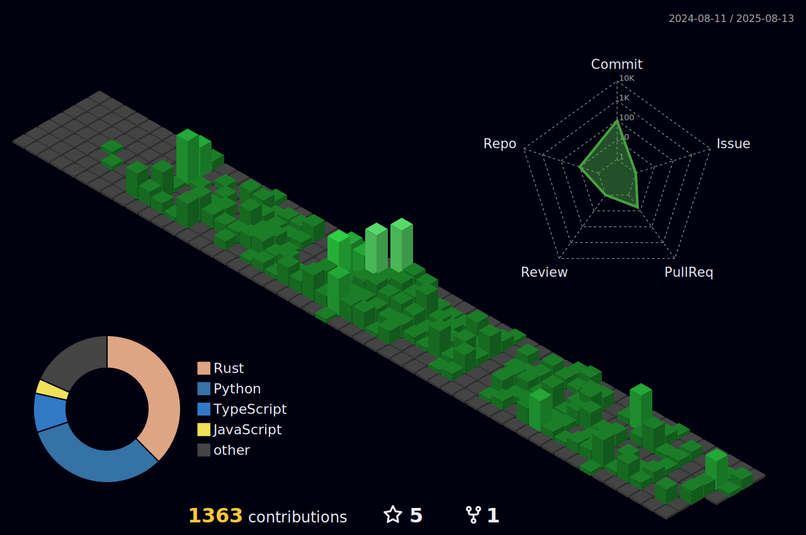

<h1 align="left">Hi there, I'm Jefte Sales!!</h1>

###

<h4 align="left">Studying web development, enthusiastic, eager to learn, and I learn easily!</h4>

###

I live in Brazil, Campinas😎 I study systems analysis and development💻 I am a Full-stack Developer 💻 🚀

###

<h5 align="left">Connect with me:</h5>

###

  
  

###

<h5 align="left">Programming languages and technologies I have experience with:</h5>

###

  
  
  
  
  
  
  
  
  
  
  
  
  
  
  
  
  
  
  

###

  
  

###
<picture align="center">
  <source media="(prefers-color-scheme: dark)" srcset="https://raw.githubusercontent.com/JefteSG/JefteSG/output/github-contribution-grid-snake-dark.svg">
  <source media="(prefers-color-scheme: light)" srcset="https://raw.githubusercontent.com/JefteSG/JefteSG/output/github-contribution-grid-snake-dark.svg">
  
</picture>
